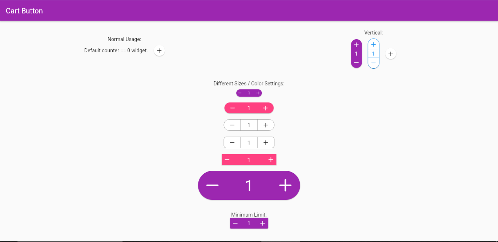

# cart_button
[](https://pub.dartlang.org/packages/cart_button)


A fully customizable Flutter Widget to get count. It can be applicable in e-commerce apps for getting cart count.

*This package is Forked from [CartStepper](https://github.com/shirne/CartStepper/)*




## Arguments
  - count: int/double, the number to show
  - stepper: int/double, the number to increasing or decreasing
  - size: double, widget size
  - axis: Axis, layout direction
  - numberSize: double, number spacer, default 2
  - onChanged: Function, @required to set the release counter
  - style: CartbuttonStyle
  - elevation: double, display a shadow around this widget
  - defaultWidget: Default widget for when counter == 0
  - onDefaultWidgetTapped: extra void function to call when default widget is tapped
  
CartButtonStyle:
  - activeForegroundColor: Color, text color when counter > 0
  - activeBackgroundColor: Color, background color when counter > 0
  - foregroundColor: Color, text color when counter == 0
  - backgroundColor: Color, background color when counter == 0
  - shape: BoxShape,
  - radius: Radius, the borderRadius of this widget, default caculating a roundedRectAngle
  - BoxBorder: Border of the Widget
  - shadowColor: Color
  - textStyle,
  - iconTheme = const IconThemeData(),
  - iconPlus: IconData, customize the plus icon
  - iconMinus: IconData, customize the minus icon
  - buttonAspectRatio: plus & minux button's aspectRatio, default 1,
  - elevation: Widget's elevation,

## Using
Create a widget to show and modify a number:
```dart
Widget _buildButton() {
  return CartButtonInt(
        count: _counter,
        size: 30,
        style: CartButtonTheme.of(context).copyWith(activeForegroundColor: Colors.purple,)
        onChanged: (count) {
        setState(() {
        _counter = count;
        });
      },
  );
}

```

## Migrating

```dart
// from 3.x to 4.x
// CartButtonStyle.
deActiveForegroundColor => foregroundColor
deActiveBackgroundColor => backgroundColor

```


